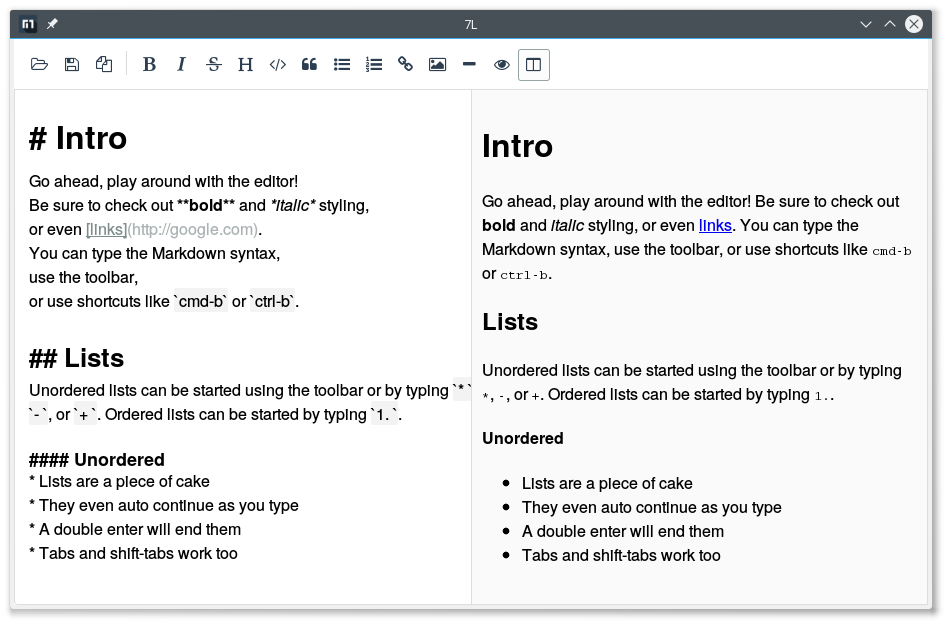

% 7L
% xalley

# 7L <small>v0.1.0</small>

本地 Markdown 编辑器,
使用 pandoc 进行转换,
使用所见即所得的编辑方式,
未来将增加 pdf 等格式输出的功能

------------------------------------------------------------------------

## 形状

## 获取途径

[github](https://github.com/xalley/7L/releases)

[百度网盘](http://pan.baidu.com/s/1mhmilPu)

## Pandoc's Markdown

[Pandoc’s Markdown 語法中文翻譯](http://pages.tzengyuxio.me/pandoc/)

## 主要成分

* [simplemde](https://github.com/NextStepWebs/simplemde-markdown-editor)

    编辑器的主要构成部分

* [pandoc](https://github.com/jgm/pandoc)

    将 markdwon 转为 html 用于预览, 也可导出其他格式文档

* [spynner](https://github.com/makinacorpus/spynner)

    浏览器, 通过 javascript_prompt_callback 实现 simplemde 保存文件到本地

 
另外, 目前用的 markdown 文件图标来自 KDE5 主题 微风

## HELP!

目前还存在很多问题, 希望各位能帮忙提提需求, 报报 BUG, 改进程序.

如果能帮忙绘制 markdown 文件的图标和程序的图标, 更是感激.

------------------------------------------------------------------------------------------

页面灵感来自[Markdown.css](http://mrcoles.com/demo/markdown-css/)

------------------------------------------------------------------------------------------

[Xalley](https://github.com/xalley/)

